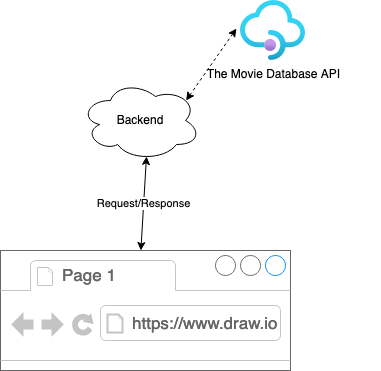

# Assessment description:
The task is to create a UI (be it either a pure rails view rendered from the backend, or any frontend rendered page) which has an input box and a search button.

Upon pressing the button, it queries movies using the value of the input, through the backend you build.

The backend may forward the query to an external api (if it doesn't have the answer) and displays the results in a list.

A; Welcome at the Stark Blockbuster Studios! 

A; Mr. Stark the owner of studio has just recently signed a contract with an API provider to serve our users queries. The contract has a daily query limit.
A; Previously by analyzing the traffic our data analytics team identiefed a few patterns regarding the usage.
A; We have bursts in the traffice for example when a fresh movie gets reviewed on some site.
A; Mr. Stark come up with the idea to only forward queries to the provider which hasn't been requested already, this way build a cache for our users.

B; Our subscription limits how many requests we are allowed to send to the 3rd party API. If that limit exceeded, we will be overcharged, so we build a server which only forward users request if the,
query is not in its cache.

A,B; Some backend code stub already prepared [lib/movies_client.rb](./lib/movies_client.rb) for the project. While building the application, integrate this file in your solution and extend it as needed.

# Requirements
- The backend is implemented in ruby
- Any ruby based framework can be used, if needed
- Any datastore can be used (flat file, SQL, No-SQL, etc)
- Access to the ["The Movie Database - registration required"](https://developers.themoviedb.org/3/search/search-movies)

# High level workflow:

## Sending Requests:
The UI sends the request to the backend.

## Processing the request on the backend:
The backend checks if the same query has recevied within 2 mins and the results are saved in it’s data store?

1. If not, it forwards the request to 3rd party API:
    - Fetch movies matching the query: The api is ["The Movie Database - registration required"](https://developers.themoviedb.org/3/search/search-movies).
    #    - This doesn't make sense since we get paginated results from the remote api: Sort (by popularity): Implement a sorting algorithms in ruby. Any algorithm can be used, it doesn't have to be the most performant. Later on, when we’ll chat about the your program, you may present the algorithm. (Eg: how it works, how performant, etc)
    - Save in a datatastore:
      - The list of movies
      - The search term(s)
      - Set search counter to 1
    - Display results
    - [senior] Make sure the "cache" is discared after it's expiration time (by default 2 mins).

2. If yes:

    If the same keyword(s) are looked up within 2 mins, it should served directly by the backend, no API request should be sent to the 3rd party API.
        [note] Keyword orders ("knigth rider" vs "rider knight")
    - Counter should be incremented by 1, showing how often was the same query sent within this 2 mins time frame.
        [note] concurrency
    - [senior] If cache hasn't expired, it's expiration should be extended by 30secs after each subsequent request.
        [note] Concurrency

## Pagination
The results should be paginated if more than 20 items returned by the query, otherwise pagination elements should not displayed.
// Pagination for the same query should be managed by the backend without reaching out to the API if this is within the 2 mins time frame.

# Bonus
- Indicate whether results are fetched from our server or from the 3rd party API (display a small notice somewhere on the screen)
- Give user feedback what's happening (progress indicators)
- Handle errors between our and the remote API service (eg: the server cannot access the 3rd party API, becuase of network issues)
- Write tests
- Deploy the application
- Think about future improvements
  [note] Implement force to skip cache feature
  #  [note] Sort by other attributes, again since we don't have the full dataset sort only make sense in terms what is visible to the user but if the user paginates FE sorting will be meaningless and confusing. So skip this.
