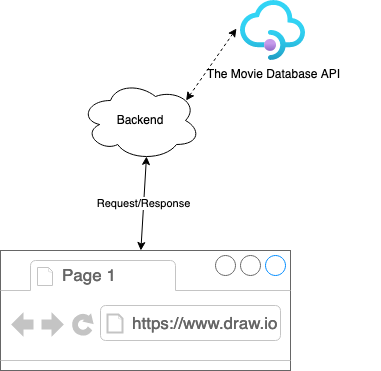
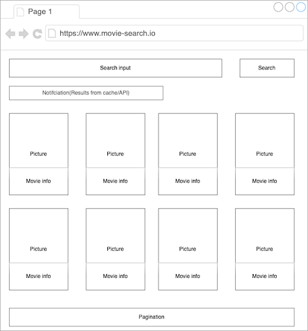

# Description:
The task is to create a UI (be it either a pure rails view rendered from the backend, or any frontend rendered page) which has an input box and a search button.

Upon pressing the button, it queries movies using the value of the input, using the backend you build.

The backend may forward the query to an external api (if it doesn't have the answer) and displays the results in a list.

Our subscription limits how many requests we are allowed to send to the 3rd party API. If that limit exceeded, we will be overcharged, so we build a server which only forward users request if the,
query is not in its cache.

Some backend code stub already prepared in [lib/movies_client.rb](./lib/movies_client.rb) for the project.
While building the application, integrate this file in your solution and implement the core logic in it.

# Requirements
- The backend is implemented in ruby
- Any ruby based framework can be used, if needed
- Any datastore can be used (flat file, SQL, No-SQL, etc)
- Access to the ["The Movie Database - registration required"](https://developers.themoviedb.org/3/search/search-movies)

When you have finished your work, upload the code to any code hosting site (Bitbucket, Github, Gitlab, etc) and provide us with link.

Simpler is better! Focus on them problem add additional features only, if you sure it is good fit.

# High level workflow:

## Sending Requests:
The UI (from the browser) sends request to the backend.

## Processing the request:
The query consist the search term and optionally the current page.

The backend checks if the same query has received within 2 mins and the results are already saved in its data store?

  1. If not, it forwards the request to 3rd party API:
    - Fetch movies matching the query: The API is ["The Movie Database - registration required"](https://developers.themoviedb.org/3/search/search-movies).
    - Save the search and its results in a datastore:
      - Results returned by The Movie Database API
      - Set cache hit count to 0

Note: For the first not cached render the counter should stay 0

  2. If yes:
    If the same keyword(s) are looked up within 2 mins:
    - Serve directly by the backend, no API request should be sent to the 3rd party API.
    - Record cache hit count should be incremented by 1

Note: The counter is very important the necessary server resources will be calculated based on it.

Display results

Indicate to the user on the UI, whether results are fetched from our server or from the 3rd party API (display a small notice somewhere on the screen)

## Pagination
The results should be paginated if more than 20 items returned by the query, otherwise pagination elements should not displayed.

## UI mockup

# Bonus
- Nice UI
- Give user feedback what's happening (progress indicators)
- Handle errors between our and the remote API service (eg: the server cannot access the 3rd party API, because of network issues)
- Write tests
- Deploy the application
- Think about future improvements

In case of any questions do not hesitate to send an email to: bfleischman@diligent.com
